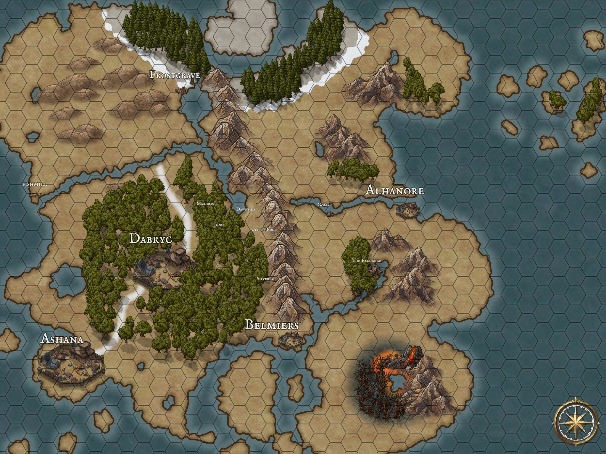

| Attribute | Description |
| --- | ----- |
| Hex Size | 60 mi |
| Estimated Distance Across | 1680 mi |
| Estimated Area | 2.2 million sq mi |
| Comparable to | Australia |

## Cities

[**Ashana**](Tuulsa/Ashana/Ashana)

**Dabrync**

## Villages

**Fishmill**