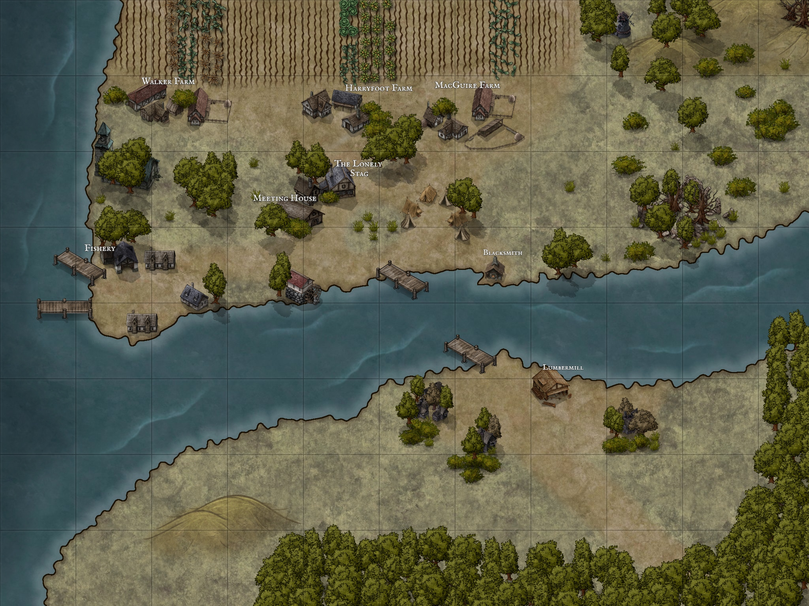

<!-- 

 -->

## Description
Fishmill is a coastal town that was abandoned for an unknown reason hundreds of years ago. It was recently reestablished after a scouting group found the area to be plentiful in fish and forestry as well as ample farmland.

Over the past year a fishery has been built with a few fisherman, several farms have been established and a wood mill is planned.

The mystery of why this land was abandoned still hangs over the town, but the current residents are doing just fine.

<!-- 

 -->

<!-- 

 -->

## Details
Race Relations
The area is re-established by humans.
There weren't any other races in the area, but several have moved into town.
Everyone is looking for a fresh start so most are accepting of people.

## Ruler Status
In the early days of the town's establishment a Firbolg moved to town and her strong will and leadership lead most of the town to looking to her as a defacto leader. There has never been any official vote to give her authority most people simply defer to her. As such, other individuals with a few followers tend to challenge her as to why she is making decisions.

## Notable Traits
The area was abandoned over a hundred years ago and no one knows why. Researchers have travelled through trying to unearth some history, but have never found anything. Now the new town has a mystique.

## Known For
The town's tavern that is run by the Firbolg, has a Firbolg ale designed for the half giant's weight.

## Buildings

### The Lonely Stag

**Details**
Tavern and Inn run by [Arelen Haelond](NPCs/ArelenHaelond), a Firbolg who lives in town with her daughter.

The inn was a barn converted for use as a tavern, the loft has only 3 rooms which has been more than enough for the merchants that come through.

There is usually fresh fish stews and game available to eat.
Ale is imported from Bavleri and there are two brewed in town.

**Menu**
Stay	8 sp/day
Game Stew	3 sp
Bread	1 cp
Cheese	1 sp
Imported Mug	8 cp
Fisherman's Brew	4 cp
Firbolg Ale	5 sp
Wine	2 sp

The Inn also acts as a trading hub: [goods](https://www.dndbeyond.com/sources/phb/equipment#TradeGoodsTable)

### Blacksmith

Details
The blacksmith shop is set up to do most commonly needed tasks for farming. Making of tools and nails. Producing horseshoes and other utilities. There is simple leather armor and simple weapons.

She has the ability to make other weapons, but has to import the resources. So it can take time and there is a bit of a mark up.

### Fishery

There is a building at the harbor where the all of the processing of the fish takes place.

### Harbor

The harbor is on the west side of town and there are currently 3 fishing boats

### Mill

The mill is being built, but there have been a few set backs. The river has flooded and goblins have attacked it a few times.

## Residents

### Haelond Family

The Haelond Family consists of Arelen and Cedric, with their daughter Daina. Arelen is the Firbolg innkeeper, Cedric is trying to get the lumbermill up and running. Diana is their 12 year old daughter and she helps her mom in the inn.

### [Thrinarv Minebreaker](NPCs/ThrinarvMinebreaker)

She is a dwarf that operates as a blacksmith in town. She is friends with Diana.

### Walker Family

The walker family were the first farmers to move to the area. Jackson and Jessie Walker run the farm with their children. Buddy and Beau are grown. Clint and Brandyne are teenagers. Loriabelle and Erin are their youngest daughters. All the family is fairly tall and lean from farm work. Their clothes are worn but well made by Jessie and Clint. All have brown hair and eyes and the girls have freckles.

### Harryfoot Family

The Harryfoot family is a halfling family. One son is from a previous marriage and is half human. Merimas Harryfoot is the father of the family. His children Wolbodo, Hiltrude, Theodelinda, and Lambert.
Wolbodo is the one that is human sized and is an adult along with Hiltrude. Theodelinda and Lambert are teens.

### MacGuire Family

MacGuire family is run by Nessa MacGuire. She moved and started a farm here. She keeps to herself mostly and has three sons. Phillip, Logan, and Sean. She has an adopted son Colm who is a half-orc and she takes care of her adult nephew Milo. Milo is rarely seen outside the farm, and when he is seen it is usually only for an hour or two.
Colm spends most of his time helping get the lumber mill running while Phillip, Logan, and Sean all work the farm.

### Glasan O'Canann

### Adran Nailo

### Fisher 3

### Fisher 4

### Land merchant

### Sea merchant